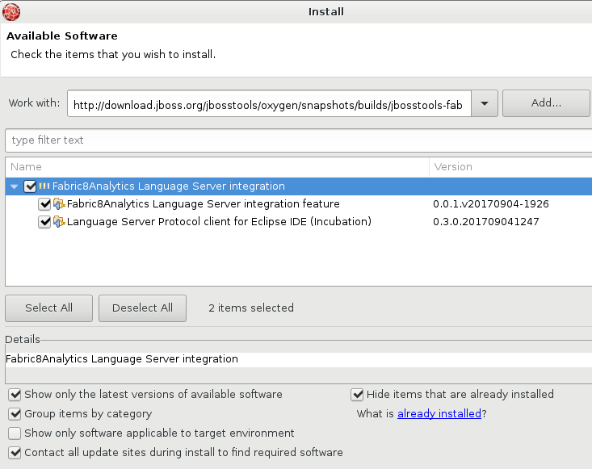
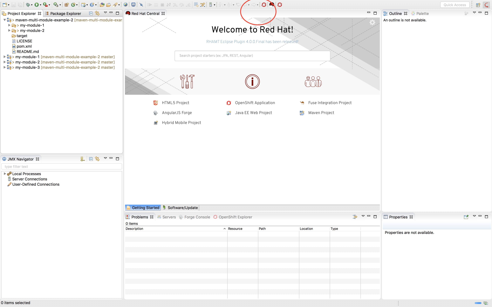
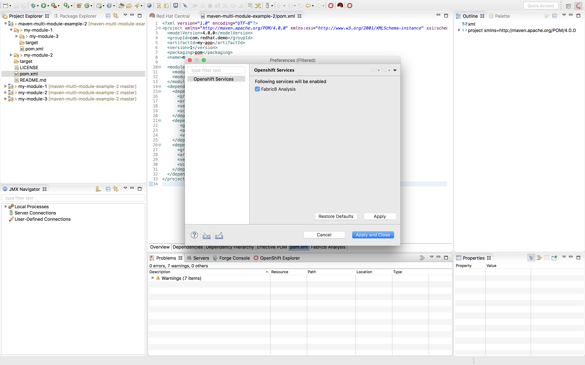
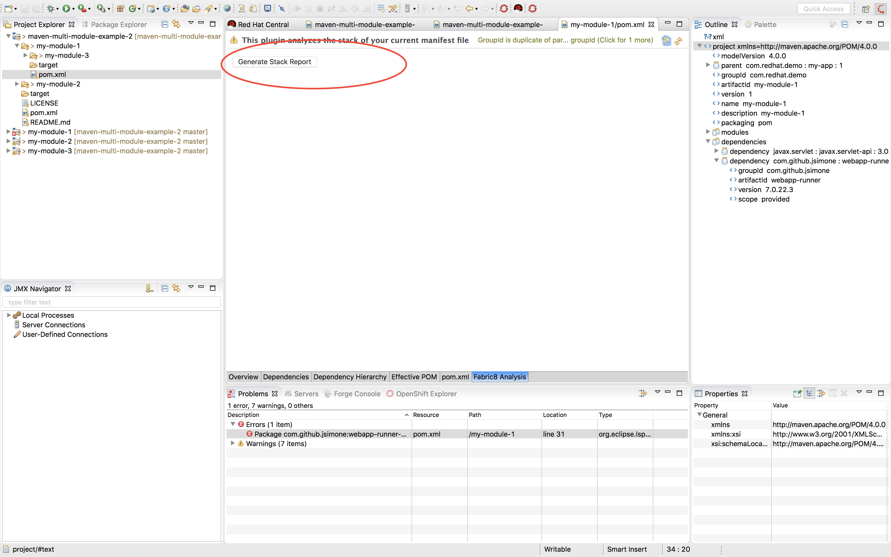
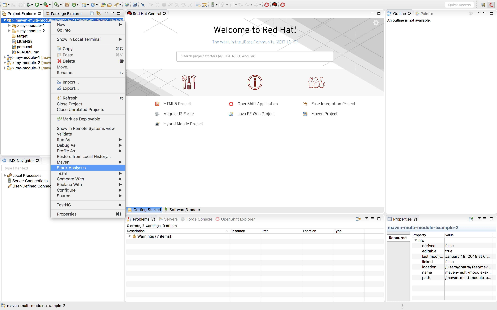
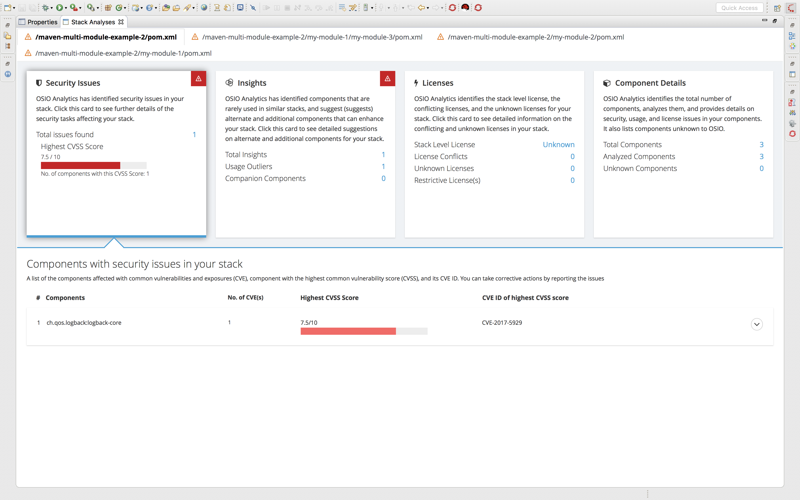
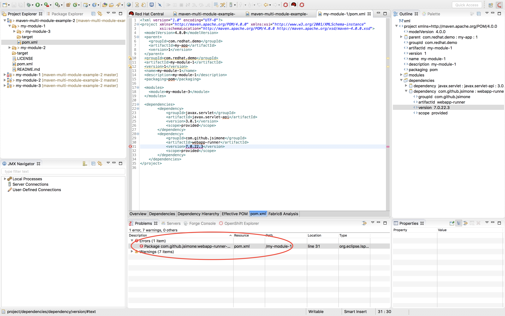
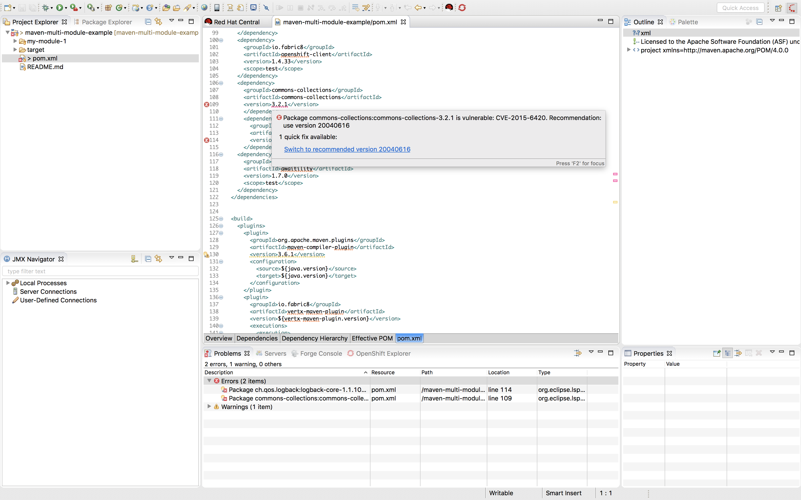

= Fabric8Analytics Language Server integration

TODO: write introduction to this project & its purpose

== Usage

* Import a project
* Open manifest file (errors will show the component analyses)
* For Stack Analyses, right click on pom.xml and click Stack Analyses

== Installation

* Start link:https://developers.redhat.com/products/devstudio/download/[Devstudio 11] (or link:https://www.eclipse.org/downloads/eclipse-packages/[Eclipse Oxygen 4.7] with link:http://tools.jboss.org/downloads/[JBoss Tools 4.5] installed)
* Help -> Install New Software...
* Work with: http://download.jboss.org/jbosstools/oxygen/snapshots/builds/jbosstools-fabric8analytics_master/latest/all/repo/
* Install Fabric8Analytics Language Server integration and Language Sever Protocol client
* Restarted when prompted

== Features

* Log In into OpenShift.io

* Enables Fabric8 analyses

* This Plugin helps to analyze your application stack on manifest level.

image:docs/images/pomSA2.png[title="manifest_level", alt="manifest_level"]

* The Plugin also analyzes stack at workspace level

* Another feature includes analyses of components of application stack as and when you type.

